# 🚀 KeyCore Stickers HD — 146 Adesivos Transparentes em Ultra Resolução (8K / 300+ DPI)

<div align="center">

[](#-galeria-completa-dos-146-adesivos)
[](#-a-escolha-dos-modelos-de-ia)
[](#-especifica%C3%A7%C3%B5es-t%C3%A9cnicas-para-impress%C3%A3o)
[](https://github.com/KeyCoreSH/stickers-keycore)

<p align="center">
  Coleção oficial completa de 146 stickers da <strong>KeyCore Tech Hub</strong>, restaurados com Super-Resolution para máxima nitidez em textos, logos e contornos de faca de corte (cutline).
</p>

[🎨 Acessar Galeria](#-galeria-completa-dos-146-adesivos) • [🧠 Escolha dos Modelos](#-a-escolha-dos-modelos-de-ia) • [⚡ Como Rodar Localmente](#-como-rodar-o-pipeline-localmente) • [🖨️ Dicas Gráficas](#-especifica%C3%A7%C3%B5es-t%C3%A9cnicas-para-impress%C3%A3o)

</div>

---

## 📖 A História do Projeto: Do Raster Borrado à Resolução 8K

O projeto começou com a criação de **10 cartelas conceituais de stickers** com a identidade visual da **KeyCore** (logos neon, mensagens sobre código, cultura ágil, pessoas e a filosofia *"Devolvemos Tempo"*).

### O Desafio
Ao extrair os 146 stickers individuais das cartelas raster, os arquivos PNG resultantes sofreram com:
1. **Borrão de Interpolação:** As letras e bordas dos ícones perderam definição, gerando transições acinzentadas e desfoque óptico (*anti-aliasing sprawl*).
2. **Mosquito Noise (Artefatos JPEG):** Ondas de ruído de compressão ao redor de tipografias e traços de alto contraste.
3. **Faca de Recorte Comprometida:** Para plotters de recorte de adesivos (die-cut / kiss-cut), um contorno borrado gera cortes denteados e sobras brancas desiguais.

### A Solução
Criamos este pipeline especializado de **Super-Resolution com Inteligência Artificial** para de-blurizar e restaurar todas as 146 imagens para mais de **8000 pixels**, transformando artes raster comprimidas em arquivos de precisão gráfica equivalentes a vetores limpos a **300+ DPI**.

---

## 🧠 A Escolha dos Modelos de IA

Avaliamos os principais modelos abertos de super-resolution da atualidade para entender qual realmente resolve o problema de **adesivos com texto**:

```
┌────────────────────────────────────────────────────────────────────────┐
│                   COMPARAÇÃO DE MODELOS PARA ADESIVOS                  │
├──────────────────────────┬───────────────────────┬─────────────────────┤
│ Modelo                   │ Comportamento Texto   │ Veredito            │
├──────────────────────────┼───────────────────────┼─────────────────────┤
│ 🥇 Real-ESRGAN Anime 6B  │ Borda sólida vetorial │ Vencedor Absoluto   │
│ 🥈 HAT / SwinIR Real-SR  │ Alta precisão linear  │ Ótimo p/ Geometria  │
│ 🥉 Real-ESRGAN General   │ Bom, mas mantém halo  │ Útil p/ Fotos       │
│ ❌ SUPIR / Diffusion     │ Alucina letras falsas │ Reprovado p/ Texto  │
│ ❌ GFPGAN / CodeFormer   │ Só restaura rostos    │ Inútil em Adesivos  │
│ ❌ Bicúbico / Lanczos    │ Apenas estica borrão  │ Sem efeito          │
└──────────────────────────┴───────────────────────┴─────────────────────┘
```

### Por que o Real-ESRGAN Anime 6B foi o Escolhido?
1. **Prior Indutivo 2D:** Treinado especificamente em traços de mangá, anime e ilustrações digitais. Sua função de perda penaliza fortemente ruídos ao redor de linhas de alto contraste.
2. **Fidelidade Tipográfica:** Não inventa caracteres e converte bordas borradas de letras em transições limpas de 1 pixel.
3. **Preservação de Transparência RGBA:** Mantém o canal alfa intacto sem manchar o contorno externo.
4. **Performance:** Roda em **~0.4s a 1s** por imagem na GPU Apple Silicon (Metal/Vulkan) ou CUDA.

> 💡 **Por que Difusão (SUPIR / StableSR) é péssima para texto?**  
> Modelos de difusão reconstroem imagens adicionando e removendo ruído guiados por prompts. Em tipografia, eles tentam "adivinhar" o que está escrito e acabam **inventando letras ilegíveis, distorcendo fontes registradas e deformando marcas**.

---

## 🔬 Resultados Visuais da POC (Antes vs Depois)

Testamos o modelo em casos reais do pack KeyCore:

| Caso de Teste | Original com Borrão | Real-ESRGAN Anime 6B (Restaurado) |
| :--- | :--- | :--- |
| **Logo Oficial (`KC01-01`)** | Halos roxos em volta de "Tech Hub", corte serrilhado | Traço azul-marinho sólido, contorno de vinil retificado |
| **Micro-Texto (`KC08-10`)** | Letras de `@keycoretechhub` e checkboxes com perda de contraste | Micro-tipografia perfeitamente legível |
| **Tipografia Grande (`KC10-02`)** | Transição azul-branco do "TEMPO" com névoa cinzenta | Cor sólida e contraste nítido de 1 pixel |

> 🖥️ **Visualizador Interativo:** Para arrastar o slider antes/depois no navegador, abra [`index.html`](index.html).

---

## 🖨️ Especificações Técnicas para Impressão

Todos os arquivos da pasta [`KeyCore_146_stickers_PNG_HD_transparentes_enhanced/PNG/`](KeyCore_146_stickers_PNG_HD_transparentes_enhanced/PNG) estão prontos para produção industrial:

* **Resolução:** Mais de **8.000 pixels** no maior lado (ex: 9280 × 3184 px, 10288 × 3200 px).
* **Densidade de Impressão:** **300 DPI a 600 DPI** para adesivos de 5 cm até 70 cm de largura.
* **Espaço de Cor:** RGBA com fundo externo 100% transparente.
* **Bordas Brancas:** Mantidas intencionalmente como margem de segurança para lâminas de recorte (*kiss-cut* ou *die-cut*).

---

## ⚡ Como Rodar o Pipeline Localmente

### Pré-requisitos
* macOS (com Apple Silicon M1/M2/M3/M4) ou Linux com GPU.
* Binário do Real-ESRGAN NCNN Vulkan pré-instalado na pasta `bin/`.

### 1. Aprimorar todos os 146 stickers (ou retomar lote)
```bash
cd adesivos
./enhance_all_stickers.sh
```
*(Ou execute a versão Python: `python3 enhance_all_stickers.py`)*

### 2. Testar um adesivo avulso
```bash
./run_poc.sh samples/meu_adesivo.png
```

---

## 🖼️ Galeria Completa dos 146 Adesivos

> Clique na miniatura ou no botão **Baixar HD** para abrir o arquivo PNG em resolução total (8K transparente).


### 📦 01. Coleção Neon & Glow (14 Stickers)

| ID | Preview | Título / Mensagem | Resolução Original | Resolução 4x (Ultra HD) | Download |
| :---: | :---: | :--- | :---: | :---: | :---: |
| **`KC01-01`** | [](KeyCore_146_stickers_PNG_HD_transparentes_enhanced/PNG/01_neon/KC01-01.png) | **KeyCore Tech Hub** | `2320 × 796 px` | **`9280 × 3184 px`** | [📥 Baixar HD](KeyCore_146_stickers_PNG_HD_transparentes_enhanced/PNG/01_neon/KC01-01.png) |
| **`KC01-02`** | [](KeyCore_146_stickers_PNG_HD_transparentes_enhanced/PNG/01_neon/KC01-02.png) | **IA: ideias, tecnologia, pessoas, impacto** | `2048 × 1563 px` | **`8192 × 6252 px`** | [📥 Baixar HD](KeyCore_146_stickers_PNG_HD_transparentes_enhanced/PNG/01_neon/KC01-02.png) |
| **`KC01-03`** | [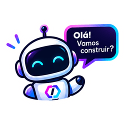](KeyCore_146_stickers_PNG_HD_transparentes_enhanced/PNG/01_neon/KC01-03.png) | **Olá! Vamos construir?** | `2048 × 1464 px` | **`8192 × 5856 px`** | [📥 Baixar HD](KeyCore_146_stickers_PNG_HD_transparentes_enhanced/PNG/01_neon/KC01-03.png) |
| **`KC01-04`** | [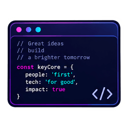](KeyCore_146_stickers_PNG_HD_transparentes_enhanced/PNG/01_neon/KC01-04.png) | **Código: people first** | `2048 × 1634 px` | **`8192 × 6536 px`** | [📥 Baixar HD](KeyCore_146_stickers_PNG_HD_transparentes_enhanced/PNG/01_neon/KC01-04.png) |
| **`KC01-05`** | [](KeyCore_146_stickers_PNG_HD_transparentes_enhanced/PNG/01_neon/KC01-05.png) | **Automação escala ideias** | `2048 × 1980 px` | **`8192 × 7920 px`** | [📥 Baixar HD](KeyCore_146_stickers_PNG_HD_transparentes_enhanced/PNG/01_neon/KC01-05.png) |
| **`KC01-06`** | [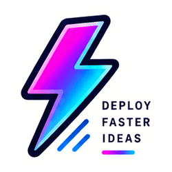](KeyCore_146_stickers_PNG_HD_transparentes_enhanced/PNG/01_neon/KC01-06.png) | **Deploy faster ideas** | `1889 × 2048 px` | **`7556 × 8192 px`** | [📥 Baixar HD](KeyCore_146_stickers_PNG_HD_transparentes_enhanced/PNG/01_neon/KC01-06.png) |
| **`KC01-07`** | [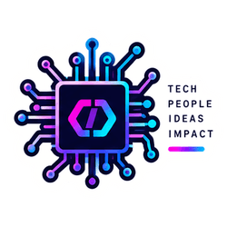](KeyCore_146_stickers_PNG_HD_transparentes_enhanced/PNG/01_neon/KC01-07.png) | **Chip: tech, people, ideas, impact** | `2048 × 1619 px` | **`8192 × 6476 px`** | [📥 Baixar HD](KeyCore_146_stickers_PNG_HD_transparentes_enhanced/PNG/01_neon/KC01-07.png) |
| **`KC01-08`** | [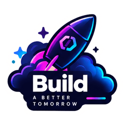](KeyCore_146_stickers_PNG_HD_transparentes_enhanced/PNG/01_neon/KC01-08.png) | **Build a better tomorrow** | `2048 × 1839 px` | **`8192 × 7356 px`** | [📥 Baixar HD](KeyCore_146_stickers_PNG_HD_transparentes_enhanced/PNG/01_neon/KC01-08.png) |
| **`KC01-09`** | [](KeyCore_146_stickers_PNG_HD_transparentes_enhanced/PNG/01_neon/KC01-09.png) | **Notebook KeyCore** | `2048 × 1516 px` | **`8192 × 6064 px`** | [📥 Baixar HD](KeyCore_146_stickers_PNG_HD_transparentes_enhanced/PNG/01_neon/KC01-09.png) |
| **`KC01-10`** | [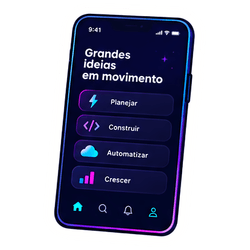](KeyCore_146_stickers_PNG_HD_transparentes_enhanced/PNG/01_neon/KC01-10.png) | **Grandes ideias em movimento** | `1382 × 2048 px` | **`5528 × 8192 px`** | [📥 Baixar HD](KeyCore_146_stickers_PNG_HD_transparentes_enhanced/PNG/01_neon/KC01-10.png) |
| **`KC01-11`** | [](KeyCore_146_stickers_PNG_HD_transparentes_enhanced/PNG/01_neon/KC01-11.png) | **Inteligência em boa companhia** | `2010 × 2048 px` | **`8040 × 8192 px`** | [📥 Baixar HD](KeyCore_146_stickers_PNG_HD_transparentes_enhanced/PNG/01_neon/KC01-11.png) |
| **`KC01-12`** | [](KeyCore_146_stickers_PNG_HD_transparentes_enhanced/PNG/01_neon/KC01-12.png) | **Tech Hub: conexão, inovação, resultados** | `2048 × 794 px` | **`8192 × 3176 px`** | [📥 Baixar HD](KeyCore_146_stickers_PNG_HD_transparentes_enhanced/PNG/01_neon/KC01-12.png) |
| **`KC01-13`** | [](KeyCore_146_stickers_PNG_HD_transparentes_enhanced/PNG/01_neon/KC01-13.png) | **Ideias hoje. Um amanhã incrível.** | `2048 × 1197 px` | **`8192 × 4788 px`** | [📥 Baixar HD](KeyCore_146_stickers_PNG_HD_transparentes_enhanced/PNG/01_neon/KC01-13.png) |
| **`KC01-14`** | [](KeyCore_146_stickers_PNG_HD_transparentes_enhanced/PNG/01_neon/KC01-14.png) | **KeyCore: more than tech** | `2048 × 920 px` | **`8192 × 3680 px`** | [📥 Baixar HD](KeyCore_146_stickers_PNG_HD_transparentes_enhanced/PNG/01_neon/KC01-14.png) |

### 📦 02. Coleção Inovação (15 Stickers)

| ID | Preview | Título / Mensagem | Resolução Original | Resolução 4x (Ultra HD) | Download |
| :---: | :---: | :--- | :---: | :---: | :---: |
| **`KC02-01`** | [](KeyCore_146_stickers_PNG_HD_transparentes_enhanced/PNG/02_inovacao/KC02-01.png) | **KeyCore Tech Hub** | `2380 × 804 px` | **`9520 × 3216 px`** | [📥 Baixar HD](KeyCore_146_stickers_PNG_HD_transparentes_enhanced/PNG/02_inovacao/KC02-01.png) |
| **`KC02-02`** | [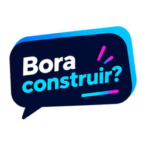](KeyCore_146_stickers_PNG_HD_transparentes_enhanced/PNG/02_inovacao/KC02-02.png) | **Bora construir?** | `2048 × 1567 px` | **`8192 × 6268 px`** | [📥 Baixar HD](KeyCore_146_stickers_PNG_HD_transparentes_enhanced/PNG/02_inovacao/KC02-02.png) |
| **`KC02-03`** | [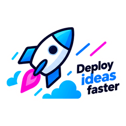](KeyCore_146_stickers_PNG_HD_transparentes_enhanced/PNG/02_inovacao/KC02-03.png) | **Deploy ideias faster** | `2048 × 1375 px` | **`8192 × 5500 px`** | [📥 Baixar HD](KeyCore_146_stickers_PNG_HD_transparentes_enhanced/PNG/02_inovacao/KC02-03.png) |
| **`KC02-04`** | [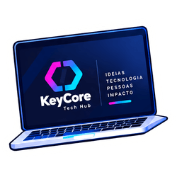](KeyCore_146_stickers_PNG_HD_transparentes_enhanced/PNG/02_inovacao/KC02-04.png) | **Notebook: ideias, tecnologia, pessoas, impacto** | `2048 × 1654 px` | **`8192 × 6616 px`** | [📥 Baixar HD](KeyCore_146_stickers_PNG_HD_transparentes_enhanced/PNG/02_inovacao/KC02-04.png) |
| **`KC02-05`** | [](KeyCore_146_stickers_PNG_HD_transparentes_enhanced/PNG/02_inovacao/KC02-05.png) | **Automação: mais tempo para o que importa** | `1987 × 2048 px` | **`7948 × 8192 px`** | [📥 Baixar HD](KeyCore_146_stickers_PNG_HD_transparentes_enhanced/PNG/02_inovacao/KC02-05.png) |
| **`KC02-06`** | [](KeyCore_146_stickers_PNG_HD_transparentes_enhanced/PNG/02_inovacao/KC02-06.png) | **Inovação transforma ideias em realidade** | `1550 × 2048 px` | **`6200 × 8192 px`** | [📥 Baixar HD](KeyCore_146_stickers_PNG_HD_transparentes_enhanced/PNG/02_inovacao/KC02-06.png) |
| **`KC02-07`** | [](KeyCore_146_stickers_PNG_HD_transparentes_enhanced/PNG/02_inovacao/KC02-07.png) | **Código em ação** | `2048 × 1068 px` | **`8192 × 4272 px`** | [📥 Baixar HD](KeyCore_146_stickers_PNG_HD_transparentes_enhanced/PNG/02_inovacao/KC02-07.png) |
| **`KC02-08`** | [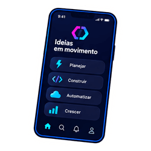](KeyCore_146_stickers_PNG_HD_transparentes_enhanced/PNG/02_inovacao/KC02-08.png) | **Ideias em movimento no celular** | `1340 × 2048 px` | **`5360 × 8192 px`** | [📥 Baixar HD](KeyCore_146_stickers_PNG_HD_transparentes_enhanced/PNG/02_inovacao/KC02-08.png) |
| **`KC02-09`** | [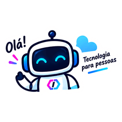](KeyCore_146_stickers_PNG_HD_transparentes_enhanced/PNG/02_inovacao/KC02-09.png) | **Tecnologia para pessoas** | `2048 × 1228 px` | **`8192 × 4912 px`** | [📥 Baixar HD](KeyCore_146_stickers_PNG_HD_transparentes_enhanced/PNG/02_inovacao/KC02-09.png) |
| **`KC02-10`** | [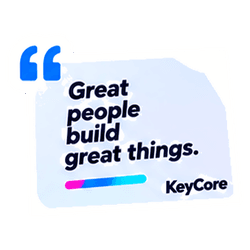](KeyCore_146_stickers_PNG_HD_transparentes_enhanced/PNG/02_inovacao/KC02-10.png) | **Great people build great things** | `2048 × 1637 px` | **`8192 × 6548 px`** | [📥 Baixar HD](KeyCore_146_stickers_PNG_HD_transparentes_enhanced/PNG/02_inovacao/KC02-10.png) |
| **`KC02-11`** | [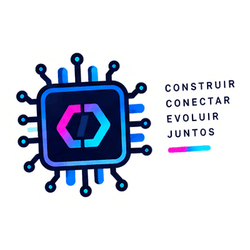](KeyCore_146_stickers_PNG_HD_transparentes_enhanced/PNG/02_inovacao/KC02-11.png) | **Construir, conectar, evoluir juntos** | `2048 × 1443 px` | **`8192 × 5772 px`** | [📥 Baixar HD](KeyCore_146_stickers_PNG_HD_transparentes_enhanced/PNG/02_inovacao/KC02-11.png) |
| **`KC02-12`** | [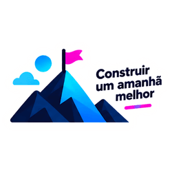](KeyCore_146_stickers_PNG_HD_transparentes_enhanced/PNG/02_inovacao/KC02-12.png) | **Construir um amanhã melhor** | `2048 × 1121 px` | **`8192 × 4484 px`** | [📥 Baixar HD](KeyCore_146_stickers_PNG_HD_transparentes_enhanced/PNG/02_inovacao/KC02-12.png) |
| **`KC02-13`** | [](KeyCore_146_stickers_PNG_HD_transparentes_enhanced/PNG/02_inovacao/KC02-13.png) | **Mais ideias, menos limites** | `2048 × 2048 px` | **`8192 × 8192 px`** | [📥 Baixar HD](KeyCore_146_stickers_PNG_HD_transparentes_enhanced/PNG/02_inovacao/KC02-13.png) |
| **`KC02-14`** | [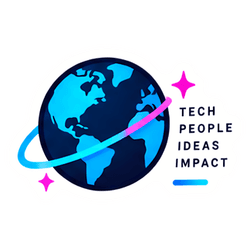](KeyCore_146_stickers_PNG_HD_transparentes_enhanced/PNG/02_inovacao/KC02-14.png) | **Tech, people, ideas, impact** | `2048 × 1397 px` | **`8192 × 5588 px`** | [📥 Baixar HD](KeyCore_146_stickers_PNG_HD_transparentes_enhanced/PNG/02_inovacao/KC02-14.png) |
| **`KC02-15`** | [](KeyCore_146_stickers_PNG_HD_transparentes_enhanced/PNG/02_inovacao/KC02-15.png) | **KeyCore: conexão, inovação, resultados** | `2048 × 571 px` | **`8192 × 2284 px`** | [📥 Baixar HD](KeyCore_146_stickers_PNG_HD_transparentes_enhanced/PNG/02_inovacao/KC02-15.png) |

### 📦 03. Coleção Tech & People (14 Stickers)

| ID | Preview | Título / Mensagem | Resolução Original | Resolução 4x (Ultra HD) | Download |
| :---: | :---: | :--- | :---: | :---: | :---: |
| **`KC03-01`** | [](KeyCore_146_stickers_PNG_HD_transparentes_enhanced/PNG/03_tech_people/KC03-01.png) | **KeyCore Tech Hub** | `2336 × 796 px` | **`9344 × 3184 px`** | [📥 Baixar HD](KeyCore_146_stickers_PNG_HD_transparentes_enhanced/PNG/03_tech_people/KC03-01.png) |
| **`KC03-02`** | [](KeyCore_146_stickers_PNG_HD_transparentes_enhanced/PNG/03_tech_people/KC03-02.png) | **Tech for people** | `2048 × 1447 px` | **`8192 × 5788 px`** | [📥 Baixar HD](KeyCore_146_stickers_PNG_HD_transparentes_enhanced/PNG/03_tech_people/KC03-02.png) |
| **`KC03-03`** | [](KeyCore_146_stickers_PNG_HD_transparentes_enhanced/PNG/03_tech_people/KC03-03.png) | **Grandes ideias nascem de pessoas** | `2048 × 1116 px` | **`8192 × 4464 px`** | [📥 Baixar HD](KeyCore_146_stickers_PNG_HD_transparentes_enhanced/PNG/03_tech_people/KC03-03.png) |
| **`KC03-04`** | [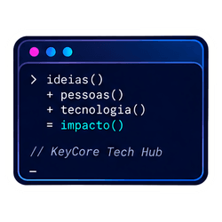](KeyCore_146_stickers_PNG_HD_transparentes_enhanced/PNG/03_tech_people/KC03-04.png) | **Ideias + pessoas + tecnologia = impacto** | `2048 × 1628 px` | **`8192 × 6512 px`** | [📥 Baixar HD](KeyCore_146_stickers_PNG_HD_transparentes_enhanced/PNG/03_tech_people/KC03-04.png) |
| **`KC03-05`** | [](KeyCore_146_stickers_PNG_HD_transparentes_enhanced/PNG/03_tech_people/KC03-05.png) | **Automatizar: mais com menos** | `2048 × 1960 px` | **`8192 × 7840 px`** | [📥 Baixar HD](KeyCore_146_stickers_PNG_HD_transparentes_enhanced/PNG/03_tech_people/KC03-05.png) |
| **`KC03-06`** | [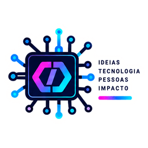](KeyCore_146_stickers_PNG_HD_transparentes_enhanced/PNG/03_tech_people/KC03-06.png) | **Chip: ideias, tecnologia, pessoas, impacto** | `2048 × 1484 px` | **`8192 × 5936 px`** | [📥 Baixar HD](KeyCore_146_stickers_PNG_HD_transparentes_enhanced/PNG/03_tech_people/KC03-06.png) |
| **`KC03-07`** | [](KeyCore_146_stickers_PNG_HD_transparentes_enhanced/PNG/03_tech_people/KC03-07.png) | **Escalar sem limites** | `1962 × 2048 px` | **`7848 × 8192 px`** | [📥 Baixar HD](KeyCore_146_stickers_PNG_HD_transparentes_enhanced/PNG/03_tech_people/KC03-07.png) |
| **`KC03-08`** | [](KeyCore_146_stickers_PNG_HD_transparentes_enhanced/PNG/03_tech_people/KC03-08.png) | **Conexão que gera oportunidades** | `1714 × 2048 px` | **`6856 × 8192 px`** | [📥 Baixar HD](KeyCore_146_stickers_PNG_HD_transparentes_enhanced/PNG/03_tech_people/KC03-08.png) |
| **`KC03-09`** | [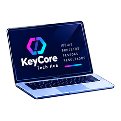](KeyCore_146_stickers_PNG_HD_transparentes_enhanced/PNG/03_tech_people/KC03-09.png) | **Notebook: ideias, projetos, pessoas, resultados** | `2048 × 1549 px` | **`8192 × 6196 px`** | [📥 Baixar HD](KeyCore_146_stickers_PNG_HD_transparentes_enhanced/PNG/03_tech_people/KC03-09.png) |
| **`KC03-10`** | [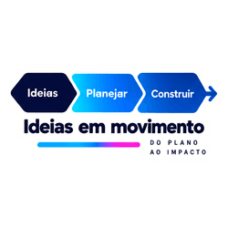](KeyCore_146_stickers_PNG_HD_transparentes_enhanced/PNG/03_tech_people/KC03-10.png) | **Ideias em movimento: do plano ao impacto** | `2048 × 928 px` | **`8192 × 3712 px`** | [📥 Baixar HD](KeyCore_146_stickers_PNG_HD_transparentes_enhanced/PNG/03_tech_people/KC03-10.png) |
| **`KC03-11`** | [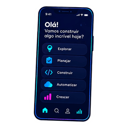](KeyCore_146_stickers_PNG_HD_transparentes_enhanced/PNG/03_tech_people/KC03-11.png) | **Vamos construir algo incrível hoje?** | `1158 × 2048 px` | **`4632 × 8192 px`** | [📥 Baixar HD](KeyCore_146_stickers_PNG_HD_transparentes_enhanced/PNG/03_tech_people/KC03-11.png) |
| **`KC03-12`** | [](KeyCore_146_stickers_PNG_HD_transparentes_enhanced/PNG/03_tech_people/KC03-12.png) | **KeyCore: pessoas, ideias, tecnologia, resultados** | `2084 × 752 px` | **`8336 × 3008 px`** | [📥 Baixar HD](KeyCore_146_stickers_PNG_HD_transparentes_enhanced/PNG/03_tech_people/KC03-12.png) |
| **`KC03-13`** | [](KeyCore_146_stickers_PNG_HD_transparentes_enhanced/PNG/03_tech_people/KC03-13.png) | **Build better: um futuro mais aberto** | `2048 × 1191 px` | **`8192 × 4764 px`** | [📥 Baixar HD](KeyCore_146_stickers_PNG_HD_transparentes_enhanced/PNG/03_tech_people/KC03-13.png) |
| **`KC03-14`** | [](KeyCore_146_stickers_PNG_HD_transparentes_enhanced/PNG/03_tech_people/KC03-14.png) | **Comunidade que constrói** | `2048 × 1694 px` | **`8192 × 6776 px`** | [📥 Baixar HD](KeyCore_146_stickers_PNG_HD_transparentes_enhanced/PNG/03_tech_people/KC03-14.png) |

### 📦 04. Coleção Construir Juntos (15 Stickers)

| ID | Preview | Título / Mensagem | Resolução Original | Resolução 4x (Ultra HD) | Download |
| :---: | :---: | :--- | :---: | :---: | :---: |
| **`KC04-01`** | [](KeyCore_146_stickers_PNG_HD_transparentes_enhanced/PNG/04_construir_juntos/KC04-01.png) | **KeyCore Tech Hub** | `2572 × 800 px` | **`10288 × 3200 px`** | [📥 Baixar HD](KeyCore_146_stickers_PNG_HD_transparentes_enhanced/PNG/04_construir_juntos/KC04-01.png) |
| **`KC04-02`** | [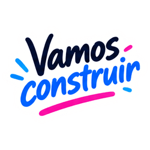](KeyCore_146_stickers_PNG_HD_transparentes_enhanced/PNG/04_construir_juntos/KC04-02.png) | **Vamos construir** | `2048 × 1401 px` | **`8192 × 5604 px`** | [📥 Baixar HD](KeyCore_146_stickers_PNG_HD_transparentes_enhanced/PNG/04_construir_juntos/KC04-02.png) |
| **`KC04-03`** | [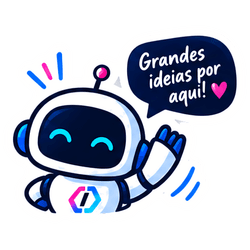](KeyCore_146_stickers_PNG_HD_transparentes_enhanced/PNG/04_construir_juntos/KC04-03.png) | **Grandes ideias por aqui!** | `2048 × 1676 px` | **`8192 × 6704 px`** | [📥 Baixar HD](KeyCore_146_stickers_PNG_HD_transparentes_enhanced/PNG/04_construir_juntos/KC04-03.png) |
| **`KC04-04`** | [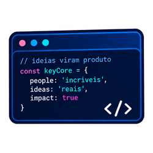](KeyCore_146_stickers_PNG_HD_transparentes_enhanced/PNG/04_construir_juntos/KC04-04.png) | **Ideias viram produto** | `2048 × 1513 px` | **`8192 × 6052 px`** | [📥 Baixar HD](KeyCore_146_stickers_PNG_HD_transparentes_enhanced/PNG/04_construir_juntos/KC04-04.png) |
| **`KC04-05`** | [](KeyCore_146_stickers_PNG_HD_transparentes_enhanced/PNG/04_construir_juntos/KC04-05.png) | **Fluxo: automação que liberta** | `2048 × 1981 px` | **`8192 × 7924 px`** | [📥 Baixar HD](KeyCore_146_stickers_PNG_HD_transparentes_enhanced/PNG/04_construir_juntos/KC04-05.png) |
| **`KC04-06`** | [](KeyCore_146_stickers_PNG_HD_transparentes_enhanced/PNG/04_construir_juntos/KC04-06.png) | **Deploy: ideias mais longe** | `1579 × 2048 px` | **`6316 × 8192 px`** | [📥 Baixar HD](KeyCore_146_stickers_PNG_HD_transparentes_enhanced/PNG/04_construir_juntos/KC04-06.png) |
| **`KC04-07`** | [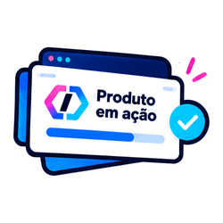](KeyCore_146_stickers_PNG_HD_transparentes_enhanced/PNG/04_construir_juntos/KC04-07.png) | **Produto em ação** | `2048 × 1427 px` | **`8192 × 5708 px`** | [📥 Baixar HD](KeyCore_146_stickers_PNG_HD_transparentes_enhanced/PNG/04_construir_juntos/KC04-07.png) |
| **`KC04-08`** | [](KeyCore_146_stickers_PNG_HD_transparentes_enhanced/PNG/04_construir_juntos/KC04-08.png) | **Juntos vamos mais longe** | `2048 × 1479 px` | **`8192 × 5916 px`** | [📥 Baixar HD](KeyCore_146_stickers_PNG_HD_transparentes_enhanced/PNG/04_construir_juntos/KC04-08.png) |
| **`KC04-09`** | [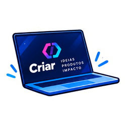](KeyCore_146_stickers_PNG_HD_transparentes_enhanced/PNG/04_construir_juntos/KC04-09.png) | **Criar: ideias, produtos, impacto** | `2048 × 1294 px` | **`8192 × 5176 px`** | [📥 Baixar HD](KeyCore_146_stickers_PNG_HD_transparentes_enhanced/PNG/04_construir_juntos/KC04-09.png) |
| **`KC04-10`** | [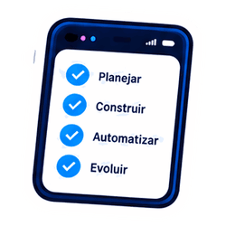](KeyCore_146_stickers_PNG_HD_transparentes_enhanced/PNG/04_construir_juntos/KC04-10.png) | **Planejar, construir, automatizar, evoluir** | `1773 × 2048 px` | **`7092 × 8192 px`** | [📥 Baixar HD](KeyCore_146_stickers_PNG_HD_transparentes_enhanced/PNG/04_construir_juntos/KC04-10.png) |
| **`KC04-11`** | [](KeyCore_146_stickers_PNG_HD_transparentes_enhanced/PNG/04_construir_juntos/KC04-11.png) | **Mais pessoas, mais impacto** | `2048 × 1844 px` | **`8192 × 7376 px`** | [📥 Baixar HD](KeyCore_146_stickers_PNG_HD_transparentes_enhanced/PNG/04_construir_juntos/KC04-11.png) |
| **`KC04-12`** | [](KeyCore_146_stickers_PNG_HD_transparentes_enhanced/PNG/04_construir_juntos/KC04-12.png) | **Ideias, tecnologia, pessoas, impacto** | `1962 × 2048 px` | **`7848 × 8192 px`** | [📥 Baixar HD](KeyCore_146_stickers_PNG_HD_transparentes_enhanced/PNG/04_construir_juntos/KC04-12.png) |
| **`KC04-13`** | [](KeyCore_146_stickers_PNG_HD_transparentes_enhanced/PNG/04_construir_juntos/KC04-13.png) | **Tech Hub: conexão, inovação, resultados** | `2048 × 1494 px` | **`8192 × 5976 px`** | [📥 Baixar HD](KeyCore_146_stickers_PNG_HD_transparentes_enhanced/PNG/04_construir_juntos/KC04-13.png) |
| **`KC04-14`** | [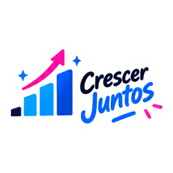](KeyCore_146_stickers_PNG_HD_transparentes_enhanced/PNG/04_construir_juntos/KC04-14.png) | **Crescer juntos** | `2048 × 1130 px` | **`8192 × 4520 px`** | [📥 Baixar HD](KeyCore_146_stickers_PNG_HD_transparentes_enhanced/PNG/04_construir_juntos/KC04-14.png) |
| **`KC04-15`** | [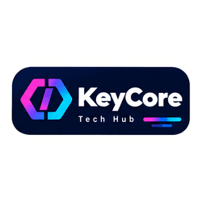](KeyCore_146_stickers_PNG_HD_transparentes_enhanced/PNG/04_construir_juntos/KC04-15.png) | **KeyCore Tech Hub: assinatura** | `2048 × 932 px` | **`8192 × 3728 px`** | [📥 Baixar HD](KeyCore_146_stickers_PNG_HD_transparentes_enhanced/PNG/04_construir_juntos/KC04-15.png) |

### 📦 05. Coleção Ideias que Movem (12 Stickers)

| ID | Preview | Título / Mensagem | Resolução Original | Resolução 4x (Ultra HD) | Download |
| :---: | :---: | :--- | :---: | :---: | :---: |
| **`KC05-01`** | [](KeyCore_146_stickers_PNG_HD_transparentes_enhanced/PNG/05_ideias_que_movem/KC05-01.png) | **KeyCore Tech Hub** | `2488 × 840 px` | **`9952 × 3360 px`** | [📥 Baixar HD](KeyCore_146_stickers_PNG_HD_transparentes_enhanced/PNG/05_ideias_que_movem/KC05-01.png) |
| **`KC05-02`** | [](KeyCore_146_stickers_PNG_HD_transparentes_enhanced/PNG/05_ideias_que_movem/KC05-02.png) | **Ideias que movem** | `2048 × 1674 px` | **`8192 × 6696 px`** | [📥 Baixar HD](KeyCore_146_stickers_PNG_HD_transparentes_enhanced/PNG/05_ideias_que_movem/KC05-02.png) |
| **`KC05-03`** | [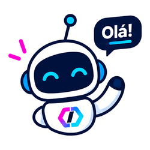](KeyCore_146_stickers_PNG_HD_transparentes_enhanced/PNG/05_ideias_que_movem/KC05-03.png) | **Olá! Robô KeyCore** | `2048 × 1892 px` | **`8192 × 7568 px`** | [📥 Baixar HD](KeyCore_146_stickers_PNG_HD_transparentes_enhanced/PNG/05_ideias_que_movem/KC05-03.png) |
| **`KC05-04`** | [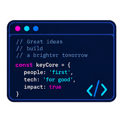](KeyCore_146_stickers_PNG_HD_transparentes_enhanced/PNG/05_ideias_que_movem/KC05-04.png) | **Código: people first, tech for good** | `2048 × 1594 px` | **`8192 × 6376 px`** | [📥 Baixar HD](KeyCore_146_stickers_PNG_HD_transparentes_enhanced/PNG/05_ideias_que_movem/KC05-04.png) |
| **`KC05-05`** | [](KeyCore_146_stickers_PNG_HD_transparentes_enhanced/PNG/05_ideias_que_movem/KC05-05.png) | **Automação escala ideias** | `2048 × 1883 px` | **`8192 × 7532 px`** | [📥 Baixar HD](KeyCore_146_stickers_PNG_HD_transparentes_enhanced/PNG/05_ideias_que_movem/KC05-05.png) |
| **`KC05-06`** | [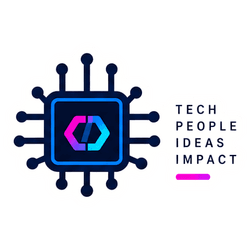](KeyCore_146_stickers_PNG_HD_transparentes_enhanced/PNG/05_ideias_que_movem/KC05-06.png) | **Chip: tech, people, ideas, impact** | `2048 × 1405 px` | **`8192 × 5620 px`** | [📥 Baixar HD](KeyCore_146_stickers_PNG_HD_transparentes_enhanced/PNG/05_ideias_que_movem/KC05-06.png) |
| **`KC05-07`** | [](KeyCore_146_stickers_PNG_HD_transparentes_enhanced/PNG/05_ideias_que_movem/KC05-07.png) | **Construir um amanhã melhor** | `2048 × 1256 px` | **`8192 × 5024 px`** | [📥 Baixar HD](KeyCore_146_stickers_PNG_HD_transparentes_enhanced/PNG/05_ideias_que_movem/KC05-07.png) |
| **`KC05-08`** | [](KeyCore_146_stickers_PNG_HD_transparentes_enhanced/PNG/05_ideias_que_movem/KC05-08.png) | **Notebook KeyCore** | `2048 × 1535 px` | **`8192 × 6140 px`** | [📥 Baixar HD](KeyCore_146_stickers_PNG_HD_transparentes_enhanced/PNG/05_ideias_que_movem/KC05-08.png) |
| **`KC05-09`** | [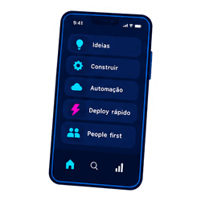](KeyCore_146_stickers_PNG_HD_transparentes_enhanced/PNG/05_ideias_que_movem/KC05-09.png) | **Ideias, construir, automação, deploy rápido** | `1275 × 2048 px` | **`5100 × 8192 px`** | [📥 Baixar HD](KeyCore_146_stickers_PNG_HD_transparentes_enhanced/PNG/05_ideias_que_movem/KC05-09.png) |
| **`KC05-10`** | [](KeyCore_146_stickers_PNG_HD_transparentes_enhanced/PNG/05_ideias_que_movem/KC05-10.png) | **Deploy rápido** | `2048 × 1594 px` | **`8192 × 6376 px`** | [📥 Baixar HD](KeyCore_146_stickers_PNG_HD_transparentes_enhanced/PNG/05_ideias_que_movem/KC05-10.png) |
| **`KC05-11`** | [](KeyCore_146_stickers_PNG_HD_transparentes_enhanced/PNG/05_ideias_que_movem/KC05-11.png) | **KeyCore: conexão, inovação, resultados** | `2764 × 692 px` | **`11056 × 2768 px`** | [📥 Baixar HD](KeyCore_146_stickers_PNG_HD_transparentes_enhanced/PNG/05_ideias_que_movem/KC05-11.png) |
| **`KC05-12`** | [](KeyCore_146_stickers_PNG_HD_transparentes_enhanced/PNG/05_ideias_que_movem/KC05-12.png) | **People first** | `2048 × 1007 px` | **`8192 × 4028 px`** | [📥 Baixar HD](KeyCore_146_stickers_PNG_HD_transparentes_enhanced/PNG/05_ideias_que_movem/KC05-12.png) |

### 📦 06. Coleção Lançar & Evoluir (13 Stickers)

| ID | Preview | Título / Mensagem | Resolução Original | Resolução 4x (Ultra HD) | Download |
| :---: | :---: | :--- | :---: | :---: | :---: |
| **`KC06-01`** | [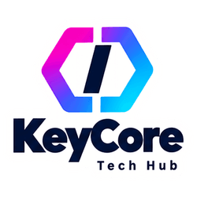](KeyCore_146_stickers_PNG_HD_transparentes_enhanced/PNG/06_lancar_e_evoluir/KC06-01.png) | **KeyCore Tech Hub** | `2048 × 1767 px` | **`8192 × 7068 px`** | [📥 Baixar HD](KeyCore_146_stickers_PNG_HD_transparentes_enhanced/PNG/06_lancar_e_evoluir/KC06-01.png) |
| **`KC06-02`** | [](KeyCore_146_stickers_PNG_HD_transparentes_enhanced/PNG/06_lancar_e_evoluir/KC06-02.png) | **Notebook: ideias, código, produto, impacto** | `2048 × 1665 px` | **`8192 × 6660 px`** | [📥 Baixar HD](KeyCore_146_stickers_PNG_HD_transparentes_enhanced/PNG/06_lancar_e_evoluir/KC06-02.png) |
| **`KC06-03`** | [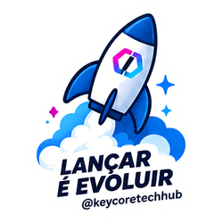](KeyCore_146_stickers_PNG_HD_transparentes_enhanced/PNG/06_lancar_e_evoluir/KC06-03.png) | **Lançar é evoluir** | `1615 × 2048 px` | **`6460 × 8192 px`** | [📥 Baixar HD](KeyCore_146_stickers_PNG_HD_transparentes_enhanced/PNG/06_lancar_e_evoluir/KC06-03.png) |
| **`KC06-04`** | [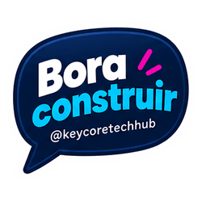](KeyCore_146_stickers_PNG_HD_transparentes_enhanced/PNG/06_lancar_e_evoluir/KC06-04.png) | **Bora construir** | `2048 × 1746 px` | **`8192 × 6984 px`** | [📥 Baixar HD](KeyCore_146_stickers_PNG_HD_transparentes_enhanced/PNG/06_lancar_e_evoluir/KC06-04.png) |
| **`KC06-05`** | [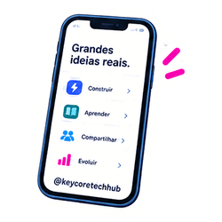](KeyCore_146_stickers_PNG_HD_transparentes_enhanced/PNG/06_lancar_e_evoluir/KC06-05.png) | **Grandes ideias reais** | `1618 × 2048 px` | **`6472 × 8192 px`** | [📥 Baixar HD](KeyCore_146_stickers_PNG_HD_transparentes_enhanced/PNG/06_lancar_e_evoluir/KC06-05.png) |
| **`KC06-06`** | [](KeyCore_146_stickers_PNG_HD_transparentes_enhanced/PNG/06_lancar_e_evoluir/KC06-06.png) | **Evolução em conjunto** | `1503 × 2048 px` | **`6012 × 8192 px`** | [📥 Baixar HD](KeyCore_146_stickers_PNG_HD_transparentes_enhanced/PNG/06_lancar_e_evoluir/KC06-06.png) |
| **`KC06-07`** | [](KeyCore_146_stickers_PNG_HD_transparentes_enhanced/PNG/06_lancar_e_evoluir/KC06-07.png) | **Automação que liberta** | `1848 × 2048 px` | **`7392 × 8192 px`** | [📥 Baixar HD](KeyCore_146_stickers_PNG_HD_transparentes_enhanced/PNG/06_lancar_e_evoluir/KC06-07.png) |
| **`KC06-08`** | [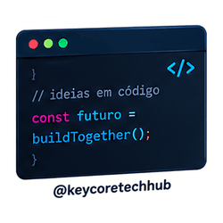](KeyCore_146_stickers_PNG_HD_transparentes_enhanced/PNG/06_lancar_e_evoluir/KC06-08.png) | **Ideias em código** | `2048 × 1883 px` | **`8192 × 7532 px`** | [📥 Baixar HD](KeyCore_146_stickers_PNG_HD_transparentes_enhanced/PNG/06_lancar_e_evoluir/KC06-08.png) |
| **`KC06-09`** | [](KeyCore_146_stickers_PNG_HD_transparentes_enhanced/PNG/06_lancar_e_evoluir/KC06-09.png) | **Pessoas, ideias, resultados** | `1864 × 2048 px` | **`7456 × 8192 px`** | [📥 Baixar HD](KeyCore_146_stickers_PNG_HD_transparentes_enhanced/PNG/06_lancar_e_evoluir/KC06-09.png) |
| **`KC06-10`** | [](KeyCore_146_stickers_PNG_HD_transparentes_enhanced/PNG/06_lancar_e_evoluir/KC06-10.png) | **Ideias em movimento: planejar, desenvolver, lançar** | `2048 × 1126 px` | **`8192 × 4504 px`** | [📥 Baixar HD](KeyCore_146_stickers_PNG_HD_transparentes_enhanced/PNG/06_lancar_e_evoluir/KC06-10.png) |
| **`KC06-11`** | [](KeyCore_146_stickers_PNG_HD_transparentes_enhanced/PNG/06_lancar_e_evoluir/KC06-11.png) | **Tecnologia sem fronteiras** | `1837 × 2048 px` | **`7348 × 8192 px`** | [📥 Baixar HD](KeyCore_146_stickers_PNG_HD_transparentes_enhanced/PNG/06_lancar_e_evoluir/KC06-11.png) |
| **`KC06-12`** | [](KeyCore_146_stickers_PNG_HD_transparentes_enhanced/PNG/06_lancar_e_evoluir/KC06-12.png) | **Inovação todo dia** | `1487 × 2048 px` | **`5948 × 8192 px`** | [📥 Baixar HD](KeyCore_146_stickers_PNG_HD_transparentes_enhanced/PNG/06_lancar_e_evoluir/KC06-12.png) |
| **`KC06-13`** | [](KeyCore_146_stickers_PNG_HD_transparentes_enhanced/PNG/06_lancar_e_evoluir/KC06-13.png) | **KeyCore: mais que tecnologia, pessoas em ação** | `1820 × 2048 px` | **`7280 × 8192 px`** | [📥 Baixar HD](KeyCore_146_stickers_PNG_HD_transparentes_enhanced/PNG/06_lancar_e_evoluir/KC06-13.png) |

### 📦 07. Coleção Keep Building (16 Stickers)

| ID | Preview | Título / Mensagem | Resolução Original | Resolução 4x (Ultra HD) | Download |
| :---: | :---: | :--- | :---: | :---: | :---: |
| **`KC07-01`** | [](KeyCore_146_stickers_PNG_HD_transparentes_enhanced/PNG/07_keep_building/KC07-01.png) | **KeyCore: build, people, ideas** | `1657 × 2048 px` | **`6628 × 8192 px`** | [📥 Baixar HD](KeyCore_146_stickers_PNG_HD_transparentes_enhanced/PNG/07_keep_building/KC07-01.png) |
| **`KC07-02`** | [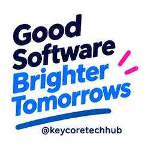](KeyCore_146_stickers_PNG_HD_transparentes_enhanced/PNG/07_keep_building/KC07-02.png) | **Good software, brighter tomorrows** | `2048 × 1973 px` | **`8192 × 7892 px`** | [📥 Baixar HD](KeyCore_146_stickers_PNG_HD_transparentes_enhanced/PNG/07_keep_building/KC07-02.png) |
| **`KC07-03`** | [](KeyCore_146_stickers_PNG_HD_transparentes_enhanced/PNG/07_keep_building/KC07-03.png) | **Solve, build, repeat** | `2048 × 1838 px` | **`8192 × 7352 px`** | [📥 Baixar HD](KeyCore_146_stickers_PNG_HD_transparentes_enhanced/PNG/07_keep_building/KC07-03.png) |
| **`KC07-04`** | [](KeyCore_146_stickers_PNG_HD_transparentes_enhanced/PNG/07_keep_building/KC07-04.png) | **KeyCore Tech Hub** | `2212 × 680 px` | **`8848 × 2720 px`** | [📥 Baixar HD](KeyCore_146_stickers_PNG_HD_transparentes_enhanced/PNG/07_keep_building/KC07-04.png) |
| **`KC07-05`** | [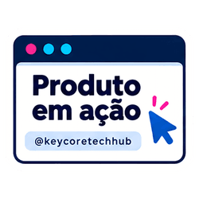](KeyCore_146_stickers_PNG_HD_transparentes_enhanced/PNG/07_keep_building/KC07-05.png) | **Produto em ação** | `2048 × 1590 px` | **`8192 × 6360 px`** | [📥 Baixar HD](KeyCore_146_stickers_PNG_HD_transparentes_enhanced/PNG/07_keep_building/KC07-05.png) |
| **`KC07-06`** | [](KeyCore_146_stickers_PNG_HD_transparentes_enhanced/PNG/07_keep_building/KC07-06.png) | **Planejar, construir, entregar** | `2048 × 1229 px` | **`8192 × 4916 px`** | [📥 Baixar HD](KeyCore_146_stickers_PNG_HD_transparentes_enhanced/PNG/07_keep_building/KC07-06.png) |
| **`KC07-07`** | [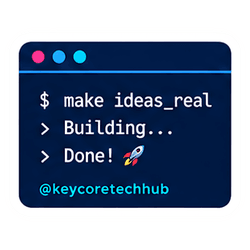](KeyCore_146_stickers_PNG_HD_transparentes_enhanced/PNG/07_keep_building/KC07-07.png) | **Make ideas real** | `2048 × 1667 px` | **`8192 × 6668 px`** | [📥 Baixar HD](KeyCore_146_stickers_PNG_HD_transparentes_enhanced/PNG/07_keep_building/KC07-07.png) |
| **`KC07-08`** | [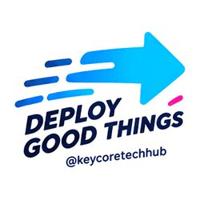](KeyCore_146_stickers_PNG_HD_transparentes_enhanced/PNG/07_keep_building/KC07-08.png) | **Deploy good things** | `2048 × 1683 px` | **`8192 × 6732 px`** | [📥 Baixar HD](KeyCore_146_stickers_PNG_HD_transparentes_enhanced/PNG/07_keep_building/KC07-08.png) |
| **`KC07-09`** | [](KeyCore_146_stickers_PNG_HD_transparentes_enhanced/PNG/07_keep_building/KC07-09.png) | **Em sincronia com o que vem** | `1801 × 2048 px` | **`7204 × 8192 px`** | [📥 Baixar HD](KeyCore_146_stickers_PNG_HD_transparentes_enhanced/PNG/07_keep_building/KC07-09.png) |
| **`KC07-10`** | [](KeyCore_146_stickers_PNG_HD_transparentes_enhanced/PNG/07_keep_building/KC07-10.png) | **Pessoas, tecnologia, grandes ideias** | `1587 × 2048 px` | **`6348 × 8192 px`** | [📥 Baixar HD](KeyCore_146_stickers_PNG_HD_transparentes_enhanced/PNG/07_keep_building/KC07-10.png) |
| **`KC07-11`** | [](KeyCore_146_stickers_PNG_HD_transparentes_enhanced/PNG/07_keep_building/KC07-11.png) | **Ideias em ação** | `1429 × 2048 px` | **`5716 × 8192 px`** | [📥 Baixar HD](KeyCore_146_stickers_PNG_HD_transparentes_enhanced/PNG/07_keep_building/KC07-11.png) |
| **`KC07-12`** | [](KeyCore_146_stickers_PNG_HD_transparentes_enhanced/PNG/07_keep_building/KC07-12.png) | **Mais ideias, mais impacto** | `1450 × 2048 px` | **`5800 × 8192 px`** | [📥 Baixar HD](KeyCore_146_stickers_PNG_HD_transparentes_enhanced/PNG/07_keep_building/KC07-12.png) |
| **`KC07-13`** | [](KeyCore_146_stickers_PNG_HD_transparentes_enhanced/PNG/07_keep_building/KC07-13.png) | **Tecnologia na sua mão** | `1190 × 2048 px` | **`4760 × 8192 px`** | [📥 Baixar HD](KeyCore_146_stickers_PNG_HD_transparentes_enhanced/PNG/07_keep_building/KC07-13.png) |
| **`KC07-14`** | [](KeyCore_146_stickers_PNG_HD_transparentes_enhanced/PNG/07_keep_building/KC07-14.png) | **Ideias que movem** | `2048 × 1517 px` | **`8192 × 6068 px`** | [📥 Baixar HD](KeyCore_146_stickers_PNG_HD_transparentes_enhanced/PNG/07_keep_building/KC07-14.png) |
| **`KC07-15`** | [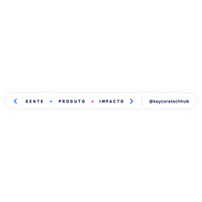](KeyCore_146_stickers_PNG_HD_transparentes_enhanced/PNG/07_keep_building/KC07-15.png) | **Gente + produto + impacto** | `3440 × 484 px` | **`13760 × 1936 px`** | [📥 Baixar HD](KeyCore_146_stickers_PNG_HD_transparentes_enhanced/PNG/07_keep_building/KC07-15.png) |
| **`KC07-16`** | [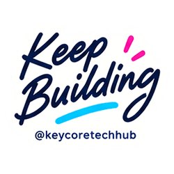](KeyCore_146_stickers_PNG_HD_transparentes_enhanced/PNG/07_keep_building/KC07-16.png) | **Keep building** | `2048 × 1621 px` | **`8192 × 6484 px`** | [📥 Baixar HD](KeyCore_146_stickers_PNG_HD_transparentes_enhanced/PNG/07_keep_building/KC07-16.png) |

### 📦 08. Coleção Código em Ação (14 Stickers)

| ID | Preview | Título / Mensagem | Resolução Original | Resolução 4x (Ultra HD) | Download |
| :---: | :---: | :--- | :---: | :---: | :---: |
| **`KC08-01`** | [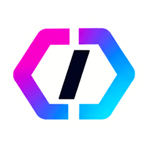](KeyCore_146_stickers_PNG_HD_transparentes_enhanced/PNG/08_codigo_em_acao/KC08-01.png) | **Símbolo KeyCore** | `2048 × 1629 px` | **`8192 × 6516 px`** | [📥 Baixar HD](KeyCore_146_stickers_PNG_HD_transparentes_enhanced/PNG/08_codigo_em_acao/KC08-01.png) |
| **`KC08-02`** | [](KeyCore_146_stickers_PNG_HD_transparentes_enhanced/PNG/08_codigo_em_acao/KC08-02.png) | **KeyCore Tech Hub** | `2384 × 708 px` | **`9536 × 2832 px`** | [📥 Baixar HD](KeyCore_146_stickers_PNG_HD_transparentes_enhanced/PNG/08_codigo_em_acao/KC08-02.png) |
| **`KC08-03`** | [](KeyCore_146_stickers_PNG_HD_transparentes_enhanced/PNG/08_codigo_em_acao/KC08-03.png) | **Deploy rápido** | `2048 × 1101 px` | **`8192 × 4404 px`** | [📥 Baixar HD](KeyCore_146_stickers_PNG_HD_transparentes_enhanced/PNG/08_codigo_em_acao/KC08-03.png) |
| **`KC08-04`** | [](KeyCore_146_stickers_PNG_HD_transparentes_enhanced/PNG/08_codigo_em_acao/KC08-04.png) | **Código em ação** | `2048 × 1190 px` | **`8192 × 4760 px`** | [📥 Baixar HD](KeyCore_146_stickers_PNG_HD_transparentes_enhanced/PNG/08_codigo_em_acao/KC08-04.png) |
| **`KC08-05`** | [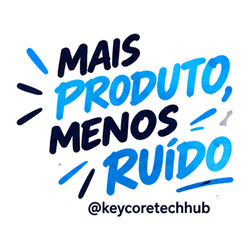](KeyCore_146_stickers_PNG_HD_transparentes_enhanced/PNG/08_codigo_em_acao/KC08-05.png) | **Mais produto, menos ruído** | `2048 × 1769 px` | **`8192 × 7076 px`** | [📥 Baixar HD](KeyCore_146_stickers_PNG_HD_transparentes_enhanced/PNG/08_codigo_em_acao/KC08-05.png) |
| **`KC08-06`** | [](KeyCore_146_stickers_PNG_HD_transparentes_enhanced/PNG/08_codigo_em_acao/KC08-06.png) | **Conexão, inovação, resultados** | `2048 × 1312 px` | **`8192 × 5248 px`** | [📥 Baixar HD](KeyCore_146_stickers_PNG_HD_transparentes_enhanced/PNG/08_codigo_em_acao/KC08-06.png) |
| **`KC08-07`** | [](KeyCore_146_stickers_PNG_HD_transparentes_enhanced/PNG/08_codigo_em_acao/KC08-07.png) | **Fluxo** | `2048 × 1033 px` | **`8192 × 4132 px`** | [📥 Baixar HD](KeyCore_146_stickers_PNG_HD_transparentes_enhanced/PNG/08_codigo_em_acao/KC08-07.png) |
| **`KC08-08`** | [](KeyCore_146_stickers_PNG_HD_transparentes_enhanced/PNG/08_codigo_em_acao/KC08-08.png) | **Comunidade que constrói** | `2048 × 1400 px` | **`8192 × 5600 px`** | [📥 Baixar HD](KeyCore_146_stickers_PNG_HD_transparentes_enhanced/PNG/08_codigo_em_acao/KC08-08.png) |
| **`KC08-09`** | [](KeyCore_146_stickers_PNG_HD_transparentes_enhanced/PNG/08_codigo_em_acao/KC08-09.png) | **Ideias em resultados** | `2048 × 1062 px` | **`8192 × 4248 px`** | [📥 Baixar HD](KeyCore_146_stickers_PNG_HD_transparentes_enhanced/PNG/08_codigo_em_acao/KC08-09.png) |
| **`KC08-10`** | [](KeyCore_146_stickers_PNG_HD_transparentes_enhanced/PNG/08_codigo_em_acao/KC08-10.png) | **Plan, build, test, deploy** | `1690 × 2048 px` | **`6760 × 8192 px`** | [📥 Baixar HD](KeyCore_146_stickers_PNG_HD_transparentes_enhanced/PNG/08_codigo_em_acao/KC08-10.png) |
| **`KC08-11`** | [](KeyCore_146_stickers_PNG_HD_transparentes_enhanced/PNG/08_codigo_em_acao/KC08-11.png) | **Na nuvem ideias vão mais longe** | `1795 × 2048 px` | **`7180 × 8192 px`** | [📥 Baixar HD](KeyCore_146_stickers_PNG_HD_transparentes_enhanced/PNG/08_codigo_em_acao/KC08-11.png) |
| **`KC08-12`** | [](KeyCore_146_stickers_PNG_HD_transparentes_enhanced/PNG/08_codigo_em_acao/KC08-12.png) | **Vamos construir?** | `2048 × 1573 px` | **`8192 × 6292 px`** | [📥 Baixar HD](KeyCore_146_stickers_PNG_HD_transparentes_enhanced/PNG/08_codigo_em_acao/KC08-12.png) |
| **`KC08-13`** | [](KeyCore_146_stickers_PNG_HD_transparentes_enhanced/PNG/08_codigo_em_acao/KC08-13.png) | **Café, código, progresso** | `1603 × 2048 px` | **`6412 × 8192 px`** | [📥 Baixar HD](KeyCore_146_stickers_PNG_HD_transparentes_enhanced/PNG/08_codigo_em_acao/KC08-13.png) |
| **`KC08-14`** | [](KeyCore_146_stickers_PNG_HD_transparentes_enhanced/PNG/08_codigo_em_acao/KC08-14.png) | **Tecnologia sem fronteiras** | `2024 × 2048 px` | **`8096 × 8192 px`** | [📥 Baixar HD](KeyCore_146_stickers_PNG_HD_transparentes_enhanced/PNG/08_codigo_em_acao/KC08-14.png) |

### 📦 09. Coleção Build Better (13 Stickers)

| ID | Preview | Título / Mensagem | Resolução Original | Resolução 4x (Ultra HD) | Download |
| :---: | :---: | :--- | :---: | :---: | :---: |
| **`KC09-01`** | [](KeyCore_146_stickers_PNG_HD_transparentes_enhanced/PNG/09_build_better/KC09-01.png) | **KeyCore Tech Hub** | `2488 × 752 px` | **`9952 × 3008 px`** | [📥 Baixar HD](KeyCore_146_stickers_PNG_HD_transparentes_enhanced/PNG/09_build_better/KC09-01.png) |
| **`KC09-02`** | [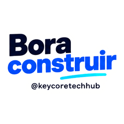](KeyCore_146_stickers_PNG_HD_transparentes_enhanced/PNG/09_build_better/KC09-02.png) | **Bora construir** | `2048 × 1181 px` | **`8192 × 4724 px`** | [📥 Baixar HD](KeyCore_146_stickers_PNG_HD_transparentes_enhanced/PNG/09_build_better/KC09-02.png) |
| **`KC09-03`** | [](KeyCore_146_stickers_PNG_HD_transparentes_enhanced/PNG/09_build_better/KC09-03.png) | **Ideias em movimento** | `2048 × 1763 px` | **`8192 × 7052 px`** | [📥 Baixar HD](KeyCore_146_stickers_PNG_HD_transparentes_enhanced/PNG/09_build_better/KC09-03.png) |
| **`KC09-04`** | [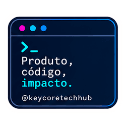](KeyCore_146_stickers_PNG_HD_transparentes_enhanced/PNG/09_build_better/KC09-04.png) | **Produto, código, impacto** | `2048 × 1759 px` | **`8192 × 7036 px`** | [📥 Baixar HD](KeyCore_146_stickers_PNG_HD_transparentes_enhanced/PNG/09_build_better/KC09-04.png) |
| **`KC09-05`** | [](KeyCore_146_stickers_PNG_HD_transparentes_enhanced/PNG/09_build_better/KC09-05.png) | **Escalar com propósito** | `1744 × 2048 px` | **`6976 × 8192 px`** | [📥 Baixar HD](KeyCore_146_stickers_PNG_HD_transparentes_enhanced/PNG/09_build_better/KC09-05.png) |
| **`KC09-06`** | [](KeyCore_146_stickers_PNG_HD_transparentes_enhanced/PNG/09_build_better/KC09-06.png) | **Na nuvem, mais longe** | `1903 × 2048 px` | **`7612 × 8192 px`** | [📥 Baixar HD](KeyCore_146_stickers_PNG_HD_transparentes_enhanced/PNG/09_build_better/KC09-06.png) |
| **`KC09-07`** | [](KeyCore_146_stickers_PNG_HD_transparentes_enhanced/PNG/09_build_better/KC09-07.png) | **Build better** | `2048 × 1198 px` | **`8192 × 4792 px`** | [📥 Baixar HD](KeyCore_146_stickers_PNG_HD_transparentes_enhanced/PNG/09_build_better/KC09-07.png) |
| **`KC09-08`** | [](KeyCore_146_stickers_PNG_HD_transparentes_enhanced/PNG/09_build_better/KC09-08.png) | **Tech for people** | `1458 × 2048 px` | **`5832 × 8192 px`** | [📥 Baixar HD](KeyCore_146_stickers_PNG_HD_transparentes_enhanced/PNG/09_build_better/KC09-08.png) |
| **`KC09-09`** | [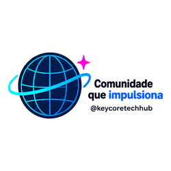](KeyCore_146_stickers_PNG_HD_transparentes_enhanced/PNG/09_build_better/KC09-09.png) | **Comunidade que impulsiona** | `2048 × 984 px` | **`8192 × 3936 px`** | [📥 Baixar HD](KeyCore_146_stickers_PNG_HD_transparentes_enhanced/PNG/09_build_better/KC09-09.png) |
| **`KC09-10`** | [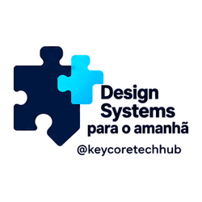](KeyCore_146_stickers_PNG_HD_transparentes_enhanced/PNG/09_build_better/KC09-10.png) | **Design systems para o amanhã** | `2048 × 1393 px` | **`8192 × 5572 px`** | [📥 Baixar HD](KeyCore_146_stickers_PNG_HD_transparentes_enhanced/PNG/09_build_better/KC09-10.png) |
| **`KC09-11`** | [](KeyCore_146_stickers_PNG_HD_transparentes_enhanced/PNG/09_build_better/KC09-11.png) | **Conectar, aprender, construir** | `2048 × 1610 px` | **`8192 × 6440 px`** | [📥 Baixar HD](KeyCore_146_stickers_PNG_HD_transparentes_enhanced/PNG/09_build_better/KC09-11.png) |
| **`KC09-12`** | [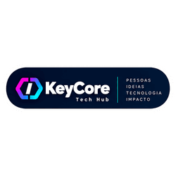](KeyCore_146_stickers_PNG_HD_transparentes_enhanced/PNG/09_build_better/KC09-12.png) | **KeyCore: pessoas, ideias, tecnologia, impacto** | `2648 × 804 px` | **`10592 × 3216 px`** | [📥 Baixar HD](KeyCore_146_stickers_PNG_HD_transparentes_enhanced/PNG/09_build_better/KC09-12.png) |
| **`KC09-13`** | [](KeyCore_146_stickers_PNG_HD_transparentes_enhanced/PNG/09_build_better/KC09-13.png) | **Grandes produtos começam aqui** | `2048 × 891 px` | **`8192 × 3564 px`** | [📥 Baixar HD](KeyCore_146_stickers_PNG_HD_transparentes_enhanced/PNG/09_build_better/KC09-13.png) |

### 📦 10. Coleção Devolvemos Tempo (20 Stickers)

| ID | Preview | Título / Mensagem | Resolução Original | Resolução 4x (Ultra HD) | Download |
| :---: | :---: | :--- | :---: | :---: | :---: |
| **`KC10-01`** | [](KeyCore_146_stickers_PNG_HD_transparentes_enhanced/PNG/10_devolvemos_tempo/KC10-01.png) | **KeyCore Tech Hub** | `2048 × 1784 px` | **`8192 × 7136 px`** | [📥 Baixar HD](KeyCore_146_stickers_PNG_HD_transparentes_enhanced/PNG/10_devolvemos_tempo/KC10-01.png) |
| **`KC10-02`** | [](KeyCore_146_stickers_PNG_HD_transparentes_enhanced/PNG/10_devolvemos_tempo/KC10-02.png) | **Devolvemos tempo** | `2048 × 1351 px` | **`8192 × 5404 px`** | [📥 Baixar HD](KeyCore_146_stickers_PNG_HD_transparentes_enhanced/PNG/10_devolvemos_tempo/KC10-02.png) |
| **`KC10-03`** | [](KeyCore_146_stickers_PNG_HD_transparentes_enhanced/PNG/10_devolvemos_tempo/KC10-03.png) | **Mais ideias, menos tarefas** | `2048 × 2025 px` | **`8192 × 8100 px`** | [📥 Baixar HD](KeyCore_146_stickers_PNG_HD_transparentes_enhanced/PNG/10_devolvemos_tempo/KC10-03.png) |
| **`KC10-04`** | [](KeyCore_146_stickers_PNG_HD_transparentes_enhanced/PNG/10_devolvemos_tempo/KC10-04.png) | **Automatize hoje. Viva o agora.** | `2048 × 1493 px` | **`8192 × 5972 px`** | [📥 Baixar HD](KeyCore_146_stickers_PNG_HD_transparentes_enhanced/PNG/10_devolvemos_tempo/KC10-04.png) |
| **`KC10-05`** | [](KeyCore_146_stickers_PNG_HD_transparentes_enhanced/PNG/10_devolvemos_tempo/KC10-05.png) | **Trabalhando para o seu tempo** | `2048 × 1256 px` | **`8192 × 5024 px`** | [📥 Baixar HD](KeyCore_146_stickers_PNG_HD_transparentes_enhanced/PNG/10_devolvemos_tempo/KC10-05.png) |
| **`KC10-06`** | [](KeyCore_146_stickers_PNG_HD_transparentes_enhanced/PNG/10_devolvemos_tempo/KC10-06.png) | **Menos processo, mais pessoas** | `2048 × 1893 px` | **`8192 × 7572 px`** | [📥 Baixar HD](KeyCore_146_stickers_PNG_HD_transparentes_enhanced/PNG/10_devolvemos_tempo/KC10-06.png) |
| **`KC10-07`** | [](KeyCore_146_stickers_PNG_HD_transparentes_enhanced/PNG/10_devolvemos_tempo/KC10-07.png) | **Tempo é o novo luxo** | `2048 × 1979 px` | **`8192 × 7916 px`** | [📥 Baixar HD](KeyCore_146_stickers_PNG_HD_transparentes_enhanced/PNG/10_devolvemos_tempo/KC10-07.png) |
| **`KC10-08`** | [](KeyCore_146_stickers_PNG_HD_transparentes_enhanced/PNG/10_devolvemos_tempo/KC10-08.png) | **IA trabalhando por você** | `2048 × 1027 px` | **`8192 × 4108 px`** | [📥 Baixar HD](KeyCore_146_stickers_PNG_HD_transparentes_enhanced/PNG/10_devolvemos_tempo/KC10-08.png) |
| **`KC10-09`** | [](KeyCore_146_stickers_PNG_HD_transparentes_enhanced/PNG/10_devolvemos_tempo/KC10-09.png) | **Foco, estratégia, liberdade, tempo** | `2048 × 2009 px` | **`8192 × 8036 px`** | [📥 Baixar HD](KeyCore_146_stickers_PNG_HD_transparentes_enhanced/PNG/10_devolvemos_tempo/KC10-09.png) |
| **`KC10-10`** | [](KeyCore_146_stickers_PNG_HD_transparentes_enhanced/PNG/10_devolvemos_tempo/KC10-10.png) | **Ctrl + Tempo** | `2048 × 1109 px` | **`8192 × 4436 px`** | [📥 Baixar HD](KeyCore_146_stickers_PNG_HD_transparentes_enhanced/PNG/10_devolvemos_tempo/KC10-10.png) |
| **`KC10-11`** | [](KeyCore_146_stickers_PNG_HD_transparentes_enhanced/PNG/10_devolvemos_tempo/KC10-11.png) | **KeyCore: devolvemos tempo** | `2048 × 947 px` | **`8192 × 3788 px`** | [📥 Baixar HD](KeyCore_146_stickers_PNG_HD_transparentes_enhanced/PNG/10_devolvemos_tempo/KC10-11.png) |
| **`KC10-12`** | [](KeyCore_146_stickers_PNG_HD_transparentes_enhanced/PNG/10_devolvemos_tempo/KC10-12.png) | **Mais vida, menos rotina** | `2048 × 1594 px` | **`8192 × 6376 px`** | [📥 Baixar HD](KeyCore_146_stickers_PNG_HD_transparentes_enhanced/PNG/10_devolvemos_tempo/KC10-12.png) |
| **`KC10-13`** | [](KeyCore_146_stickers_PNG_HD_transparentes_enhanced/PNG/10_devolvemos_tempo/KC10-13.png) | **Automação que te leva mais longe** | `2048 × 1344 px` | **`8192 × 5376 px`** | [📥 Baixar HD](KeyCore_146_stickers_PNG_HD_transparentes_enhanced/PNG/10_devolvemos_tempo/KC10-13.png) |
| **`KC10-14`** | [](KeyCore_146_stickers_PNG_HD_transparentes_enhanced/PNG/10_devolvemos_tempo/KC10-14.png) | **Tecnologia para o que realmente importa** | `2048 × 1398 px` | **`8192 × 5592 px`** | [📥 Baixar HD](KeyCore_146_stickers_PNG_HD_transparentes_enhanced/PNG/10_devolvemos_tempo/KC10-14.png) |
| **`KC10-15`** | [](KeyCore_146_stickers_PNG_HD_transparentes_enhanced/PNG/10_devolvemos_tempo/KC10-15.png) | **Caos desligado, tempo ligado** | `2048 × 1643 px` | **`8192 × 6572 px`** | [📥 Baixar HD](KeyCore_146_stickers_PNG_HD_transparentes_enhanced/PNG/10_devolvemos_tempo/KC10-15.png) |
| **`KC10-16`** | [](KeyCore_146_stickers_PNG_HD_transparentes_enhanced/PNG/10_devolvemos_tempo/KC10-16.png) | **Ideias, projetos, pessoas, tempo** | `2048 × 1238 px` | **`8192 × 4952 px`** | [📥 Baixar HD](KeyCore_146_stickers_PNG_HD_transparentes_enhanced/PNG/10_devolvemos_tempo/KC10-16.png) |
| **`KC10-17`** | [](KeyCore_146_stickers_PNG_HD_transparentes_enhanced/PNG/10_devolvemos_tempo/KC10-17.png) | **Seu tempo vale mais** | `2048 × 1522 px` | **`8192 × 6088 px`** | [📥 Baixar HD](KeyCore_146_stickers_PNG_HD_transparentes_enhanced/PNG/10_devolvemos_tempo/KC10-17.png) |
| **`KC10-18`** | [](KeyCore_146_stickers_PNG_HD_transparentes_enhanced/PNG/10_devolvemos_tempo/KC10-18.png) | **Tecnologia sem complicação para mais humanidade** | `2048 × 1005 px` | **`8192 × 4020 px`** | [📥 Baixar HD](KeyCore_146_stickers_PNG_HD_transparentes_enhanced/PNG/10_devolvemos_tempo/KC10-18.png) |
| **`KC10-19`** | [](KeyCore_146_stickers_PNG_HD_transparentes_enhanced/PNG/10_devolvemos_tempo/KC10-19.png) | **Mais tempo para o que importa** | `2048 × 1667 px` | **`8192 × 6668 px`** | [📥 Baixar HD](KeyCore_146_stickers_PNG_HD_transparentes_enhanced/PNG/10_devolvemos_tempo/KC10-19.png) |
| **`KC10-20`** | [](KeyCore_146_stickers_PNG_HD_transparentes_enhanced/PNG/10_devolvemos_tempo/KC10-20.png) | **KeyCore: devolvemos tempo, assinatura** | `2048 × 977 px` | **`8192 × 3908 px`** | [📥 Baixar HD](KeyCore_146_stickers_PNG_HD_transparentes_enhanced/PNG/10_devolvemos_tempo/KC10-20.png) |


---

## 📦 Estrutura do Repositório

```
.
├── README.md                                          # Documentação completa e galeria
├── index.html                                         # App interativo com split-slider antes/depois
├── enhance_all_stickers.sh                            # Script shell de lote com GPU
├── enhance_all_stickers.py                            # Script python alternativo
├── run_poc.sh                                         # Runner 1-clique para teste individual
├── bin/                                               # Binário standalone Real-ESRGAN e modelos
├── thumbnails/                                        # Miniaturas leves para a galeria do README
├── KeyCore_146_stickers_PNG_HD_transparentes/         # Imagens originais (raster de origem)
└── KeyCore_146_stickers_PNG_HD_transparentes_enhanced/# Imagens restauradas em 8K / 300+ DPI
    ├── indice.csv
    ├── LEIA-ME.txt
    └── PNG/
        ├── 01_neon/ (14 PNGs)
        ├── 02_inovacao/ (15 PNGs)
        ├── 03_tech_people/ (14 PNGs)
        ├── 04_construir_juntos/ (15 PNGs)
        ├── 05_ideias_que_movem/ (12 PNGs)
        ├── 06_lancar_e_evoluir/ (13 PNGs)
        ├── 07_keep_building/ (16 PNGs)
        ├── 08_codigo_em_acao/ (14 PNGs)
        ├── 09_build_better/ (13 PNGs)
        └── 10_devolvemos_tempo/ (20 PNGs)
```

---

## 🌐 Repositório Remoto

* **GitHub:** [https://github.com/KeyCoreSH/stickers-keycore](https://github.com/KeyCoreSH/stickers-keycore)
* **Organização:** [KeyCoreSH](https://github.com/KeyCoreSH)

Feito com 💙 pelo time de engenharia e design da **KeyCore Tech Hub**.
